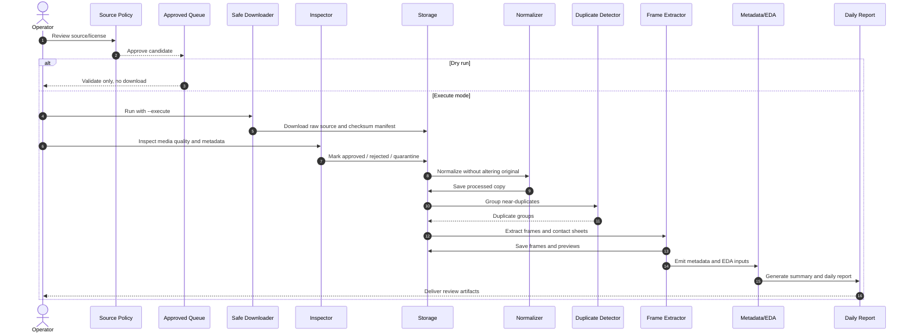

# 17. Pipeline xử lý video online

## Mục lục
- [Luồng](#luồng)
- [Lưu trữ](#lưu-trữ)
- [Công cụ](#công-cụ)

## Luồng
Validate source/license → queue approved → tải an toàn → inspect → normalize không phá gốc → checksum → nhóm trùng → tách frame → near-duplicate → contact sheet → metadata/EDA/daily report. Mặc định pipeline là `--dry-run`; cần `--execute` mới xử lý/tải thật.

### Sequence diagram

## Lưu trữ
Gốc: `storage_placeholders/online_data/raw/`; bản chuẩn: `processed/`; lỗi: `quarantine/`; rejected, frames và contact sheets tách riêng. Các thư mục chỉ giữ `.gitkeep` trong Git. Tên gốc `src_<source_id>_<item_id>_<original_name>.<ext>`; processed: `YYYYMMDD_<source_type>_<camera_type>_<condition>_<source_id>_<sequence>.mp4`, kèm JSON cùng stem.

## Công cụ
`ffprobe`/`ffmpeg` là tùy chọn. Nếu thiếu, script báo hướng dẫn cài rõ ràng; validate/report vẫn chạy. Không tự tải công cụ không rõ nguồn.
