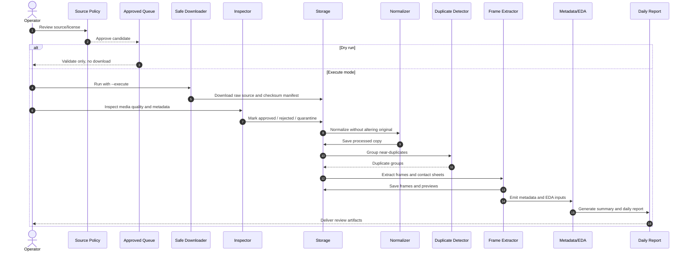

# Sequence Diagram - Video Processing Pipeline

## Notes
- This diagram is designed for Mermaid-compatible renderers.
- You can save this file as Markdown and preview it in VS Code or GitHub.
- If you want, I can also generate a PNG/SVG version next.
